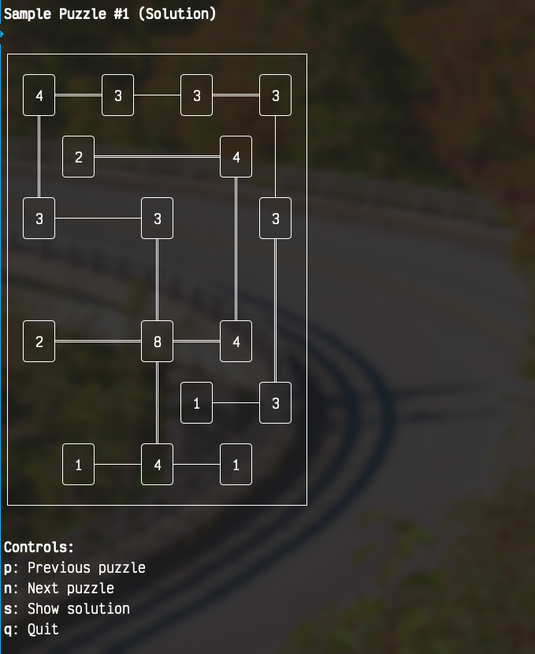

# BridgesCLI
A CLI-based Bridges (Hashiwokakero) puzzle renderer built with React and Ink. This exists mostly to
gain more experience with an agent-based workflow.

## What is Hashiwokakero?
Hashiwokakero (橋をかけろ, "build bridges") is a logic puzzle where you connect islands with bridges.
Each island has a number indicating how many bridges must connect to it.



## Run the puzzle (interactive mode - press q to quit)
``` bash
bun start
```

### CLI Options
- `-s, --stdout` - Output to stdout and exit immediately (for testing)
- `-p, --puzzle <identifier>` - Render a puzzle via shorthand encoding (see `samplePuzzles.ts`)

## Run tests and linter
``` bash
bun run typecheck
bun run test
bun run lint
```
