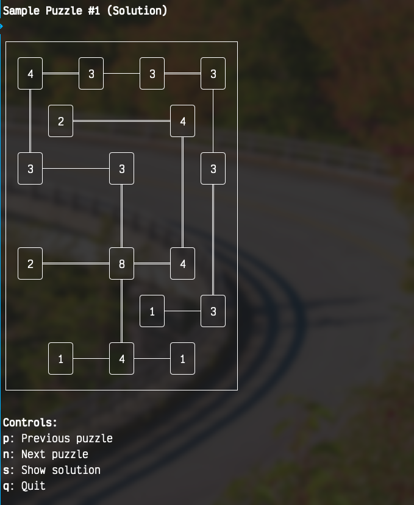

# BridgesCLI
A CLI-based Bridges puzzle renderer built with React and Ink. This exists mostly to
gain more experience using an agent-based workflow.

## What is Bridges?
Bridges (also known as Hashiwokakero) is a logic puzzle where you connect islands with bridges.
Each island has a number indicating how many bridges must connect to it.



## Run the game
``` bash
npm install -g bridges-cli
bridges
```

## Local Development
Clone the repo then run:
``` bash
bun start
```

### CLI Options
- `-p, --puzzle <identifier>` - Render a puzzle via shorthand encoding (see `samplePuzzles.ts`)

### Run tests and linter
``` bash
bun run typecheck
bun run test
bun run lint
```
